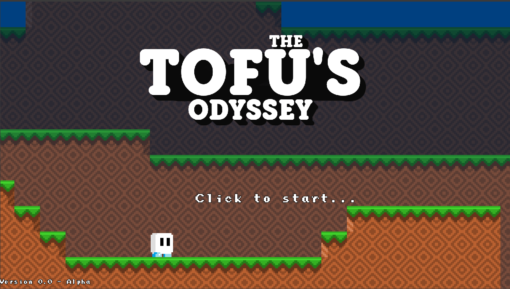

# Tofu's Odyssey - 2D platform game made with C++/SFML

<!---Esses são exemplos. Veja https://shields.io para outras pessoas ou para personalizar este conjunto de escudos. Você pode querer incluir dependências, status do projeto e informações de licença aqui--->
Play it here :(https://yurifarion.000webhostapp.com/Coin%20War/index.html)

> Tofu's Odyssey is a 2D platform game that is being made in C++ and SFML, it is still in production.

[⬆Back to the top](#SpaceBulletTime) 
This is a platform game made using c++ and sfml.

Credits:
 "Tofuman" by Emcee Flesher on OpenGameArt.org
